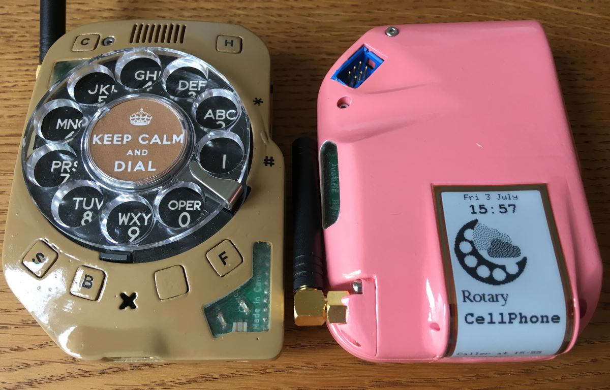

# RotaryCellphone

The motivation behind this fork is to complete the original firmware (April 2020) to a good working state with a range of basic features while keeping to the original framework (e.g. North American area code prepend) as closely as possible. 

Secondary motivation is to contribute something back to Justine for making this excellent 3G project open source.

## Hardware changes

### Hardware modification

FONA Tx cannot talk to the ATmega2560 microcontroller after the e-paper display is initialised. This is because the FONA serial UART tries to talk to the ATmega on pin 19, which is also the ATmega hardware SPI SS pin. When the ATmega is configured as master, SS is configured as output with idle state high. This means the FONA Tx output is connected to an ATmega output!

**Quick and dirty hack:** the ATmega SPI SS pin could be reset to input mode after display initialisation. This would work until the FONA pulls SS low causing the ATmega to switch its SPI to slave mode. The ATmega then locks up when it call the display functions. This ATmega SPI mode switch is done in ATmega hardware, aka microcode, and can't be changed. The quick and dirty hack is to use a watchdog timer to reset the ATmega after it locks up. See here for an example: [forum discussion on firmware](https://skysedge.us/forum/viewtopic.php?f=4&t=1486&start=25).

**Better solution:** is to use another ATmega pin for FONA Tx. Pin 25, (aka Aduino digital pin 12) was chosed because it is one of the few ATmega pins that work with Software Serial and because its corner position makes it easier to solder. **The firmware in this fork requires that FONA Tx is re-wired from pin 19 to pin 25.**

FONA Tx rewired to ATmega pin 25 with 0.2mm 'Vero' wire.

### Vibration motor

The vibration motor circuit, if available and installed, is working. The vibrate alert is enabled when ring volume is set to zero.

**Important:** comment out `#define HAS_VIBRATE` depending on board version. If the board has space for a vibration motor, this should be left defined whether or not a motor is fitted. This is due to differences in connections to the mode switch between board versions.

## Firmware development

**This fork only works with the above FONA Tx hardware re-wire mod.**

### Filename change

Changed name of *main.ino* to *RotaryCellphone.ino*. This removes the requirement to put everything in a *main* subfolder and makes development a little easier from a Git local repository. All sketch files should be directly under the folder: *RotaryCellphone*.

### Working features

- Reliably decode FONA messages by parsing AT command responses
- Fix signal strength and battery charge bargraph displays
- Display time from cell network using fast partial update
- Parse and display incoming call ID using fast partial update
- Display graphics on the e-Ink display, slow full refresh (2s)
- Query call state in a 1 second loop to detect hook status
- Get *no-prepend* mode to dial variable length numbers (for non North American numbering schemes)
- Vibration motor works (if installed) when ring level set to zero
- FONA will sleep (but still receive calls) after 5 minutes, doubling battery life to 2 days.
- FONA will wake up on receiving a call or if the 'C' button is held for 1 second.
- Hold the 'C' button for 1s to return to the default screen after a number lookup
- Shutdown the phone when battery voltage drops below 3.3V
- Restart the phone when battery voltage rises above 3.5V (recharging)
- When the phone shuts down, the Hook LED flashes once every 4s to indicate charging is required
- Passthrough mode. Hold 'C' while the phone is starting to communicate with the FONA module directly.
- Easter egg, sorry there aren't any... yet!

## Future work

August 2020: no new features are planned for this fork, only bug fixes.

It might be possible to use a third party phone module library, some have been considered. TinyGSM is compatible with the SIM5320 but currently not for voice - keep an eye on TinyGSM developments. The Adafruit FONA library requires the RI (ring indicator) wired to a pin using a specific interupt (another hardware mod would be required). A third party library is likely to require several ATmega pin changes.
