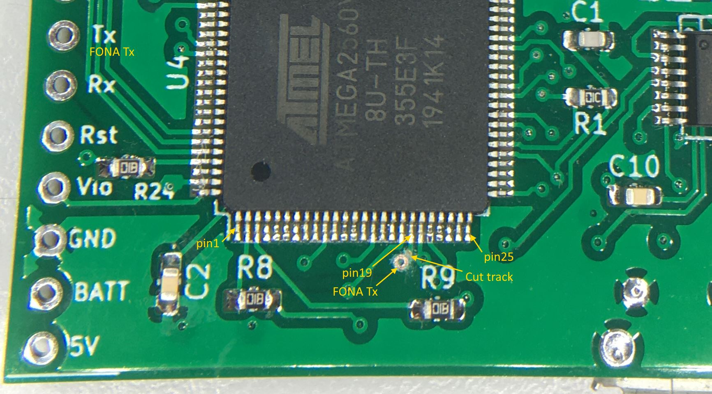
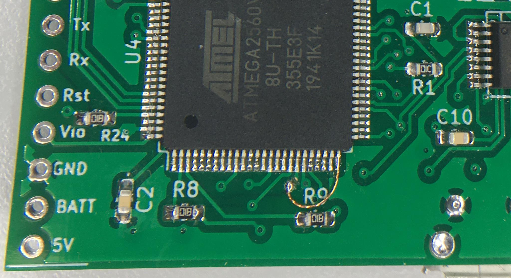

# RotaryCellphone
The motive behind this fork is to get the original firmware (April 2020), to a fully functional base. It is not the intention to add a host of new functions (other than time display), localisation or customisation but simply to complete the original framework. There is no intention to make a derivitive.

I don't intend to add much more... otherwise I would buy a smartphone! I welcome reports of bugs/issues then I'll likely archive this after a few months. There are too many possibilities for localisation and customisation that I don't want to get tied up with this. After all this is a DIY project, have fun with customisations, make it personal.

Enjoy, it's been fun building this in lockdown!

Thanks Justine.

## Issues & Troubleshooting
### Hardware mod
FONA Tx cannot talk to the ATmega2560 microcontroller after the e-paper display is initialised. This is because the FONA tries to talk to the ATmega on pin 19, which is also the ATmega hardware SPI SS pin. When the ATmega is configured as master, SS is configured as output with idle state high.

In theory the SS pin could be switched back to input after display initialisation but when the FONA pulls SS low, the ATmega SPI switches to slave mode (see datasheet section 21.1.2). The display then stops working. This mode switch is done in ATmega hardware, it can't be changed.

The more reliable solution is to use another pin for FONA Tx. **This fork requires that FONA Tx is re-wired from pin 19 to pin 25**. The new pin was chosen because of its proximity, corner pins are easier to solder to and pin 25, (aka Aduino digital pin 12) is one of the few Mega pins that work with Software Serial.

FONA Tx rewired to ATmega pin 25 with 0.2mm 'Vero' wire.

### Filename change
Changed name of *main.ino* to *RotaryCellphone.ino*. This removes the requirement to put everything in a *main* subfolder and makes development a little easier from a Git local repository. All sketch files should be directly under the folder: *RotaryCellphone*.

## Roadmap
**This fork will require the FONA Tx hardware re-wire mod.**

- Reliably decode FONA messages by parsing AT command responses - *done*
- Fix Signal strength and battery charge display - *done*
- Display time from cell network - *done*
- Parse and display incoming call ID - *done*
- Get NP mode to dial variable length numbers, fix no tone for dialled 0 - *done*
- Query call state in the 1 second loop to detect hook status - *done*
- Send the ATmega to sleep occasionally (save 16mA) to increase battery life... *maybe*

It might be possible to use a third party phone module library, some have been considered. TinyGSM is compatible with the SIM5320 but currently not for voice - keep an eye on TinyGSM developments. The Adafruit FONA library requires the RI (ring indicator) wired to a pin using a specific interupt (another hardware mod would be required).
